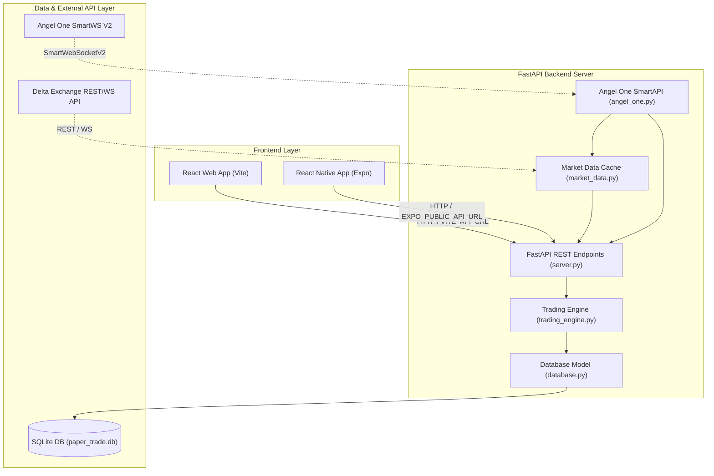
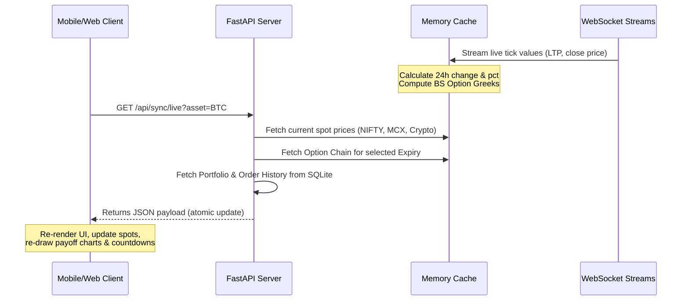
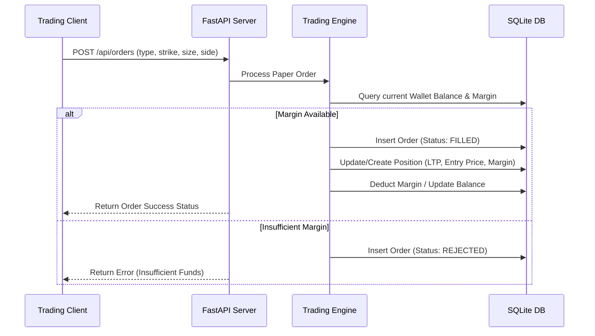

# System Architecture & Workflow Document

This document outlines the architecture, components, data flows, and security details of the Delta Exchange & Indian Markets Options Trading Terminal.

---

## 1. System Overview

The application is a high-performance options trading terminal supporting multiple asset classes across different markets (Crypto, Indian Equities/Indices, and MCX Commodities). It matches the professional interface aesthetics of Delta Exchange and integrates live market feeds with a mock paper trading engine.

---

## 2. Core Components

### 2.1 Frontend Clients (Web & Mobile)
* **React Web Frontend (Vite + TypeScript):**
  - Styled with custom CSS matching Delta Exchange dark theme values.
  - Implements custom payoff matrices, interactive straddle/strangle strategy selectors, and spot line indicators.
  - Hardened with a global `fetch` rewriter in `src/main.tsx` translating local IP targets to environment-controlled production endpoints.
* **React Native Mobile App (Expo + TypeScript):**
  - Real-time `600ms` atomic sync polling loop fetching spot ticks, expiries, chains, portfolio balances, and active positions in a single request.
  - Custom option Greeks calculations, live "Time to Expiry" countdown timer, and dynamic change percentage coloring (green for profit/increase, red for loss/decrease).

### 2.2 FastAPI Backend Server (`backend/server.py`)
* Serves as the central API gateway.
* Configured with dynamic CORS middleware loading allowed origins from the `ALLOWED_ORIGINS` environment variable.
* Handles option chain aggregation, synchronizing Indian indexes (NIFTY, BANKNIFTY) from Angel One, Commodities (CRUDEOIL, GOLD, SILVER) from MCX, and Crypto (BTC, ETH, XAUT) from Delta Exchange.

### 2.3 Angel One Integration Hub (`backend/angel_one.py`)
* Automates session login via SmartAPI using client credentials and TOTP secrets.
* Connects to `SmartWebSocketV2` to stream tick data for indices and MCX spots.
* Includes a **Synthetic Chain Generator** using Black-Scholes pricing model to generate high-fidelity option chains and option Greeks in real-time when the market is closed or specific contract info is missing.

### 2.4 Market Data Module (`backend/market_data.py`)
* Coordinates connection managers for Delta Exchange websockets.
* Implements slow-polling fallbacks for REST tickers to maintain 100% price resilience.

### 2.5 Trading Engine (`backend/trading_engine.py`)
* Simulates order execution, position tracking, margin updates, and PnL calculation.
* Dynamically calculates projected PnL for selected strategy baskets based on potential price offsets.

---

## 3. Core Workflows

### 3.1 Live Market Synchronization Workflow
The mobile/web client requests `/api/sync/live` every 600ms. The backend handles this request as follows:

### 3.2 Order Routing & Paper Trading Workflow
When a user clicks BUY (B) or SELL (S) on a contract strike:

---

## 4. Database Schema (SQLite)

The database (`backend/paper_trade.db`) consists of three primary tables managing paper trading activities:

### 4.1 Accounts Table (`accounts`)
Stores active paper balances, virtual margins, and equity profiles.
* `id` (INTEGER, Primary Key)
* `name` (TEXT)
* `balance` (REAL) - Remaining cash/equity.
* `margin_used` (REAL) - Capital locked in active positions.

### 4.2 Orders Table (`orders`)
Records transaction history for all orders placed.
* `id` (INTEGER, Primary Key)
* `account_id` (INTEGER, Foreign Key)
* `symbol` (TEXT) - Option contract code.
* `asset` (TEXT) - Underlying index (e.g. NIFTY, BTC).
* `side` (TEXT) - `BUY` or `SELL`.
* `qty` (INTEGER)
* `price` (REAL) - Premium price.
* `status` (TEXT) - `FILLED`, `PENDING`, or `REJECTED`.
* `timestamp` (TEXT)

### 4.3 Positions Table (`positions`)
Tracks active open positions and locked margin requirements.
* `id` (INTEGER, Primary Key)
* `account_id` (INTEGER, Foreign Key)
* `symbol` (TEXT)
* `asset` (TEXT)
* `qty` (INTEGER) - Positive for Longs, Negative for Shorts.
* `entry_price` (REAL)
* `margin` (REAL) - Locked capital size.

---

## 5. Mathematical Abstractions

### 5.1 Option Greeks (Black-Scholes Model)
Option prices and Greeks are calculated analytically using the standard Black-Scholes model:

$$d_1 = \frac{\ln(S/K) + (r + \sigma^2/2)T}{\sigma\sqrt{T}}, \quad d_2 = d_1 - \sigma\sqrt{T}$$

* **Call Price:** $C = S \cdot N(d_1) - K \cdot e^{-rT} \cdot N(d_2)$
* **Put Price:** $P = K \cdot e^{-rT} \cdot N(-d_2) - S \cdot N(-d_1)$
* **Delta (Call):** $\Delta_C = N(d_1)$
* **Delta (Put):** $\Delta_P = N(d_1) - 1$
* **Gamma:** $\Gamma = \frac{N'(d_1)}{S\sigma\sqrt{T}}$
* **Vega:** $\nu = S\sqrt{T} \cdot N'(d_1)$

---

## 6. Security Controls & Hardening

* **Dynamic CORS Settings:** Wildcards (`*`) are disabled in production. Allowable domains are restricted through the `ALLOWED_ORIGINS` environment variable.
* **Database Path Resilience:** `paper_trade.db` path is dynamically computed relative to the `backend/database.py` script location. This prevents DB replication issues when running shell scripts from other project folders.
* **Angel One Credential Isolation:** Authentication tokens and login TOTP keys are read directly from `.env` environment contexts, preventing secrets leaks.
